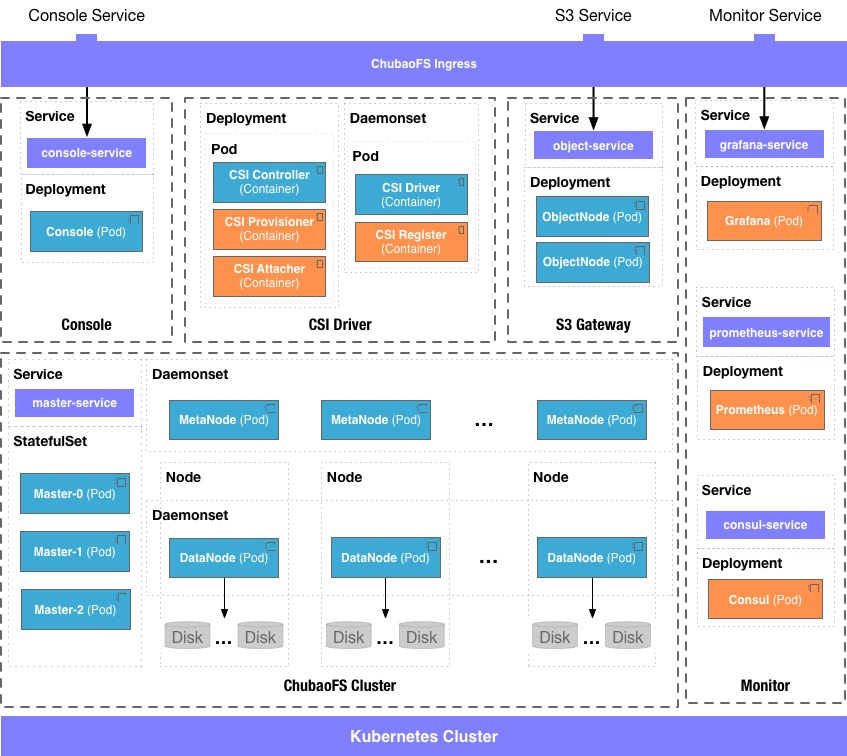

# cubefs-helm

## Deploy Cubefs using Kubernetes and Helm

The cubefs-helm project helps deploy a Cubefs cluster orchestrated by Kubernetes.

## Cubefs Components


## Cubefs Deployment



### Prerequisite

* Kubernetes 1.14+
* CSI spec version 1.1.0
* Helm 3

### Download cubefs-helm

```shell
git clone https://github.com/cubefs/cubefs-helm
cd cubefs-helm
```

### Create configuration yaml file

Create a `cubefs.yaml` file, and put it in a user-defined path. Suppose this is where we put it.

```shell
vim ~/cubefs.yaml 
```

``` yaml
# Select which component to install
component:
  master: true
  datanode: true
  metanode: true
  objectnode: true
  client: false
  provisioner: false
  monitor: false
  ingress: true

# store data,log and other data, these directory will be
#  mounted from host to container using hostPath
path:
  data: /var/lib/cubefs
  log: /var/log/cubefs

datanode:
  # Disks will be used by datanode to storage data
  # Format: disk_mount_point:reserved_space
  # disk_mount_point: the mount point of disk in machine
  # reserved_space: similar to metanode reserved space, if disk available
  # space less than this number, then the disk will be unwritable
  disks:
    - /data0:21474836480
    - /data1:21474836480

metanode:
  # Total memory metanode can use, recommended to be configured
  # as 80% of physical machine memory
  total_mem: "26843545600"

provisioner:
  kubelet_path: /var/lib/kubelet
```

> Note that `cubefs/values.yaml` shows all the config parameters of Cubefs.
> The parameters `path.data` and `path.log` are used to store server data and logs, respectively.

### Add labels to Kubernetes node

You should tag each Kubernetes node with the appropriate labels accorindly for server node and CSI node of Cubefs.

```shell
kubectl label node <nodename> component.cubefs.io/master=enabled
kubectl label node <nodename> component.cubefs.io/metanode=enabled
kubectl label node <nodename> component.cubefs.io/datanode=enabled
kubectl label node <nodename> component.cubefs.io/objectnode=enabled
kubectl label node <nodename> component.cubefs.io/csi=enabled
```

### Deploy Cubefs cluster

```shell
helm upgrade --install cubefs  -f ~/cubefs.yaml -n cubefs --create-namespace cubefs
```

The output of `helm install` shows servers to be deployed.

Use the following command to check pod status, which may take a few minutes.

```shell
kubectl -n cubefs get pods
NAME                         READY   STATUS    RESTARTS   AGE
cfs-csi-controller-cfc7754b-ptvlq   3/3     Running   0          2m40s
cfs-csi-node-q262p                  2/2     Running   0          2m40s
cfs-csi-node-sgvtf                  2/2     Running   0          2m40s
client-55786c975d-vttcx             1/1     Running   0          2m40s
consul-787fdc9c7d-cvwgz             1/1     Running   0          2m40s
datanode-2rcmz                      1/1     Running   0          2m40s
datanode-7c9gv                      1/1     Running   0          2m40s
datanode-s2w8z                      1/1     Running   0          2m40s
grafana-6964fd5775-6z5lx            1/1     Running   0          2m40s
master-0                            1/1     Running   0          2m40s
master-1                            1/1     Running   0          2m34s
master-2                            1/1     Running   0          2m27s
metanode-bwr8f                      1/1     Running   0          2m40s
metanode-hdn5b                      1/1     Running   0          2m40s
metanode-w9snq                      1/1     Running   0          2m40s
objectnode-6598bd9c87-8kpvv         1/1     Running   0          2m40s
objectnode-6598bd9c87-ckwsh         1/1     Running   0          2m40s
objectnode-6598bd9c87-pj7fc         1/1     Running   0          2m40s
prometheus-6dcf97d7b-5v2xw          1/1     Running   0          2m40s
```

Check cluster status

```shell
helm status cubefs
```

## Use Cubefs CSI as backend storage

After installing Cubefs using helm, the StorageClass named `cfs-sc` of Cubefs has been created. Next, you can to create
a PVC that the `storageClassName`  value is `cfs-sc` to using Cubefs as backend storage.

An example `pvc.yaml` is shown below.

```yaml
apiVersion: v1
kind: PersistentVolumeClaim
metadata:
  name: cfs-pvc
spec:
  accessModes:
  - ReadWriteMany
  volumeMode: Filesystem
  resources:
    requests:
      storage: 5Gi
  storageClassName: cfs-sc
```

```shell
kubectl create -f pvc.yaml
```

There is an example `deployment.yaml` using the PVC as below

```yaml
apiVersion: apps/v1
kind: Deployment
metadata:
  name: cfs-csi-demo
spec:
  replicas: 1
  selector:
    matchLabels:
      app: cfs-csi-demo-pod
  template:
    metadata:
      labels:
        app: cfs-csi-demo-pod
    spec:
      nodeSelector:
        cubefs-csi-node: enabled
      containers:
        - name: cfs-csi-demo
          image: nginx:1.17.9
          imagePullPolicy: "IfNotPresent"
          ports:
            - containerPort: 80
              name: "http-server"
          volumeMounts:
            - mountPath: "/usr/share/nginx/html"
              name: mypvc
      volumes:
        - name: mypvc
          persistentVolumeClaim:
            claimName: cfs-pvc
```

```shell
kubectl create -f deployment.yaml
```

## Config Monitoring System (optional)

Monitor daemons are started if the cluster is deployed with cubefs-helm. Cubefs uses Consul, Prometheus and Grafana to construct the monitoring system.

Accessing the monitor dashboard requires Kubernetes Ingress Controller. In this example, the [Nginx Ingress](https://github.com/kubernetes/ingress-nginx) is used. Download the [default config yaml file](https://raw.githubusercontent.com/kubernetes/ingress-nginx/master/deploy/static/mandatory.yaml), and add `hostNetwork: true` in the `spec` section.

```yaml
spec:
  # wait up to five minutes for the drain of connections
  terminationGracePeriodSeconds: 300
  serviceAccountName: nginx-ingress-serviceaccount
  hostNetwork: true
  nodeSelector:
    kubernetes.io/os: linux
```

Start the ingress controller

```shell
kubectl apply -f mandatory.yaml
```

Get the IP address of Nginx ingress controller.

```shell
kubectl get pods --all-namespaces -o wide | grep nginx-ingress-controller
ingress-nginx   nginx-ingress-controller-5bbd46cd86-q88sw    1/1     Running   0          115m   10.196.31.101   host-10-196-31-101   <none>           <none>
```

Get the host name of Grafana which should also be used as domain name.

```shell
kubectl get ingress -n cubefs
NAME      HOSTS                  ADDRESS         PORTS   AGE
grafana   monitor.cubefs.com   10.106.207.55   80      24h
```

Add a local DNS in `/etc/hosts` in order for a request to find the ingress controller.

```yaml
10.196.31.101 monitor.cubefs.com
```

At this point, dashboard can be visited by `http://monitor.cubefs.com`.

## Uninstall Cubefs

uninstall Cubefs cluster using helm

```shell
helm delete cubefs
```
